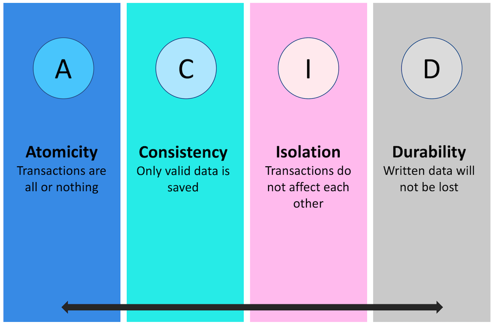

# ACID

Set of properties of database transactions intended to guarantee validity even in the event of errors, power failures, etc

- `Atomicity` either the entire transaction succeeds or the entire thing fails
- `Consistency` all database rules are enforced or the entire transaction is rolled back
- `Isolation` no transaction is affected by any other transaction that is still in progress
- `Durability` once a transaction is committed it stays, even if the system crashes immediately after

## See also

- [CAP theorem](./cap.md)
- [Wikipedia](https://en.wikipedia.org/wiki/ACID)
