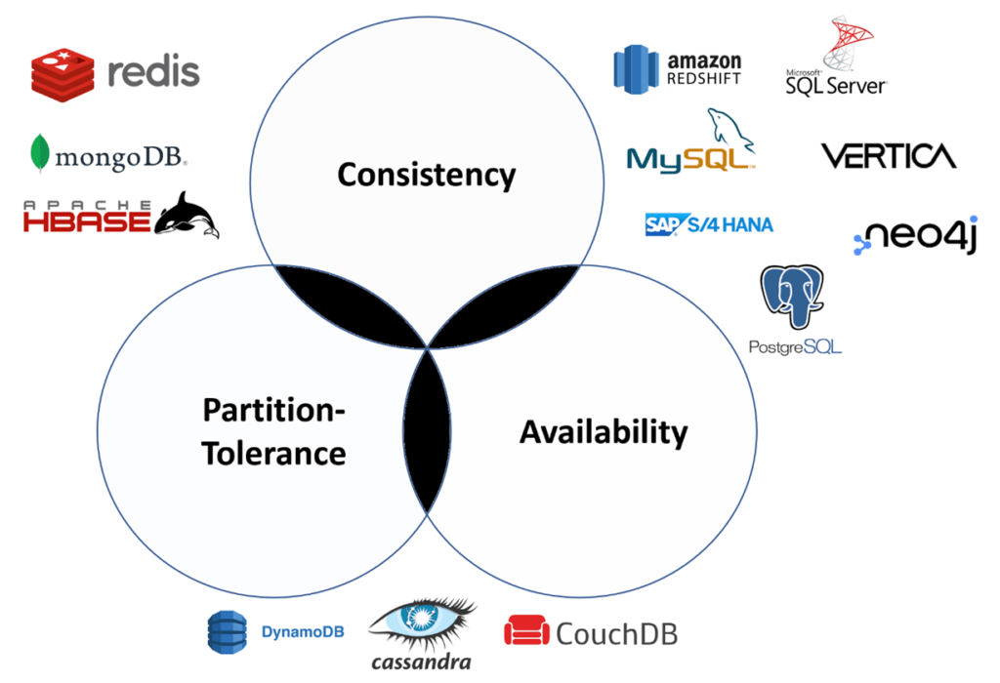

# `CAP theorem`

A distributed system can guarantee only two of the following three properties

- `Consistency`
- `Availability`
- `Partition tolerance`

## See also

- [ACID](./acid.md)
- [Wikipedia](https://en.wikipedia.org/wiki/CAP_theorem)
