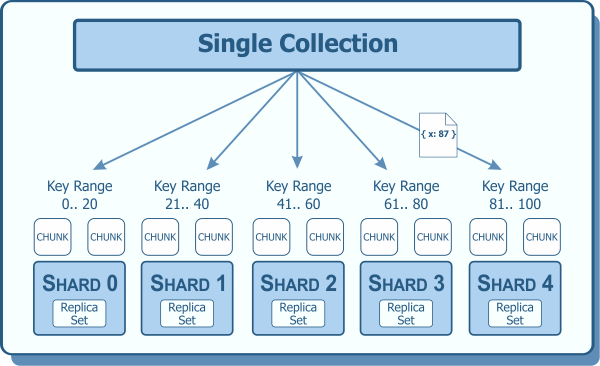

# Sharding

Is a method for distributing data across multiple machines

## Advantages

- [Horizontal scaling](./horizontal-scaling.md) Sharding distributes data across multiple servers, allowing an application to perform more transactions per second than a non-sharded database.
- `Load balancing` Sharding equally distributes the load among servers, enabling an application to use the maximum capacity of each server.
- `Fault tolerance` Sharding replicates data across multiple servers, ensuring that the application remains operational even if one server fails.

