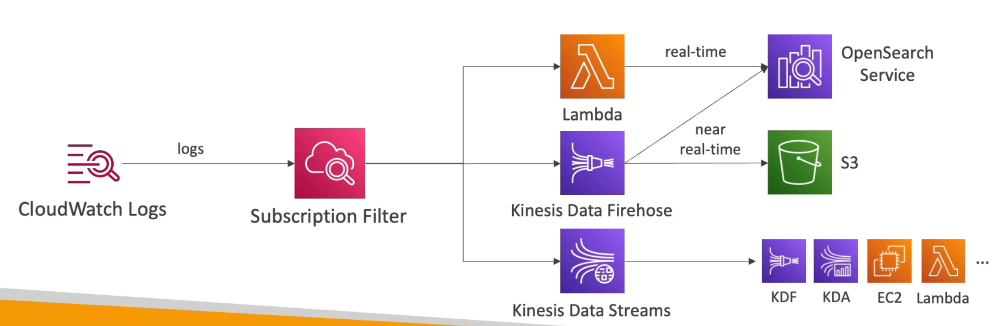

# CloudWath logs

You can **group logs** assigning them an arbitrary name, usually representing an application or a component. **Log stream** is a sequence of log events that share the same source.

It supports **log policies** like `never expire`, `expire after a number of days`, or `expire after a certain date`.

You can send logs to

- Amazon S3 (through *exports*)
- Kinesis Data Streams
- Kinesis Data Firehose
- AWS Lambda
- OpenSearch

**Logs are encrypted by default** but you can **setup KMS-based encryption** with your own keys

