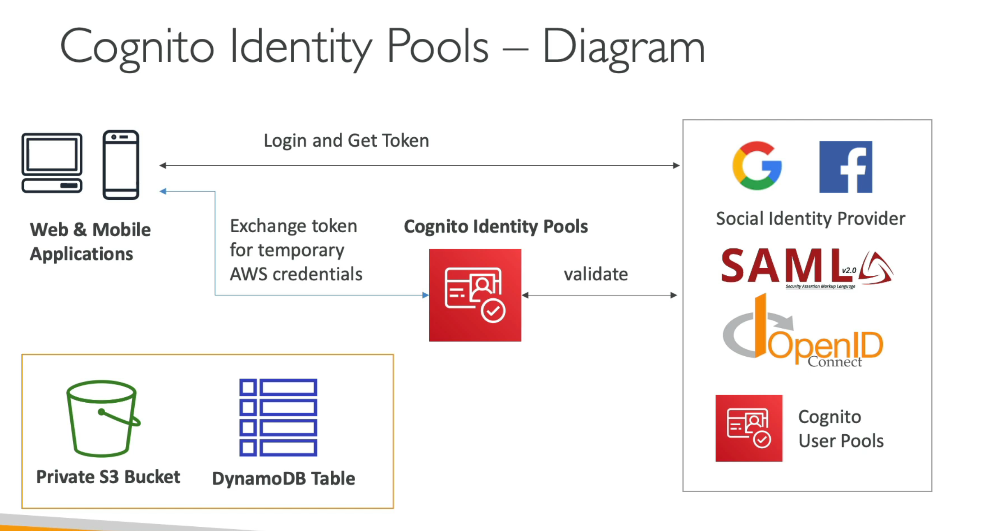

# AWS Cognito

## Overview of AWS Cognito

AWS Cognito is a **fully managed service** that provides `authentication`, `authorization`, and `user management` for web and mobile applications. It allows developers to add **user sign-up, sign-in, and access control** to their applications securely and at scale. Cognito supports **identity federation**, enabling users to log in using social identity providers like `Google`, `Facebook`, and `Apple`, or enterprise identity providers via `SAML`.

## Key Features

- `User Pools` Manage user directories with features like sign-up, sign-in, and multi-factor authentication (MFA).
- `Identity Pools` Provide temporary AWS credentials to grant users access to AWS resources.
- `Social and Enterprise Identity Federation` Integrate with social identity providers and SAML-based enterprise identity providers.
- `Custom Authentication Flows` Support for building custom authentication workflows using AWS Lambda triggers.
- `Secure Token Service` Issues JSON Web Tokens (JWTs) for secure communication between clients and servers.

## Use cases

1. **User Authentication**
   - A mobile app uses `Cognito User Pools` to authenticate users with email and password.
   - After successful authentication, the app receives an **ID token (JWT)** to access backend APIs.

2. **Identity Federation**
   - A web application allows users to log in using their **Google accounts**.
   - `Cognito Identity Pools` provide temporary AWS credentials to access an S3 bucket for file uploads.

3. **Custom Authentication**
   - An e-commerce platform implements a **custom authentication flow** using Lambda triggers to validate users based on a one-time password (OTP) sent via SMS.

### Key Takeaways

- `Scalable and Secure` Cognito scales automatically to handle millions of users while ensuring secure authentication.
- `Flexible Integration` Supports integration with various identity providers and custom workflows.
- `Cost-Effective` Pay only for active users and the features you use.
- `Token-Based Authentication` Simplifies secure communication between clients and backend services.

AWS Cognito is widely used for building **secure, scalable, and user-friendly authentication systems** for modern applications
