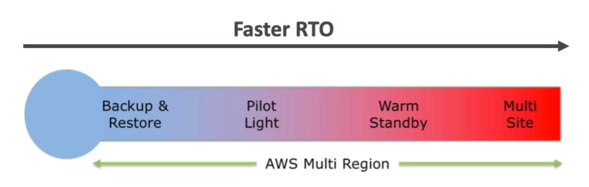

# Disaster recovery

> `RPO` - Recovery Point Objective
> `RTO` - Recovery Time Objective

## Backup and restore

Consist on taking regular backups of your data and restoring it in case of a disaster. It has a **high RPO** since the data is only as recent as the last backup. It also has a **high RTO** since the data needs to be restored from the backup and that can take a long time

## Pilot light

A **small version** of the app is always running. This is done for the **most critical components of the app**. When a disaster happens, the rest of the app can be quickly spun up around the pilot light. It has a **low RPO** and a **low RTO**

## Warm standby

A **scaled down version** of the app is always running. When a disaster happens, the app can be quickly scaled up. It has a **low RPO** and a **low RTO**

## Hot site/ multi-site

Very **low RPO and RTO** but also **very expensive**. A **complete replica** of the app **is always running**. When a disaster happens, the traffic can be quickly redirected to the hot site
