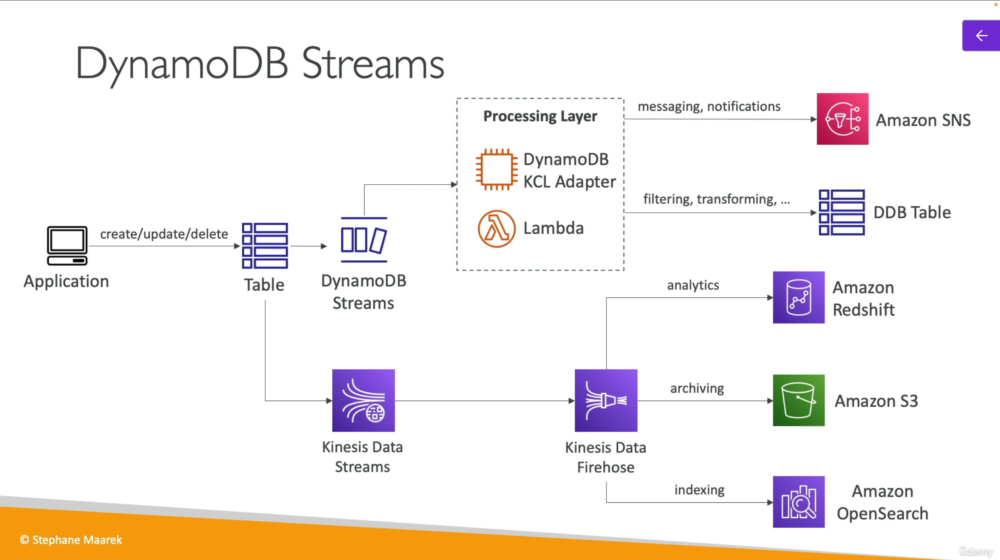

# Dynamo DB

**Fully managed NoSQL database** service that provides fast and predictable performance with seamless scalability

- **Has transaction support**
- Scales to massive workloads due to its distributed architecture
- Fast and consistent performance (single digit milliseconds)
- Integrated with IAM
  - Security
  - Authorization
  - Administration
- **Low cost** and auto-scaling capabilities
- **No maintenance or patching. Always available**
- **Standard and infrequent access (IA) table class**

## Basic features

- Has tables, items (*rows*) and attributes (*columns*)
- Supports an infinite number of items
- Each item has `attributes` that can be added over time and also be `null`

## Supported data types

1. Scalar
   - Number
   - String
   - Binary
   - Boolean
   - Null
2. Document
   - List
   - Map
3. Set
   - Number set
   - String set
   - Binary set

## Capacity modes

### Provisioned

- You specify the number of reads and writes per second
- **Good for predictable workloads**
- Pay for ****provisioned capacity****
  - Read Capacity Units (RCU)
  - Write Capacity Units (WCU)
- **Auto-scaling** is available

### On-demand

- **No capacity planning needed**
- For unpredictable workloads and sudden spikes
- Pay for **actual reads and writes**. It is more expensive than provisioned

## DynamoDB Accelerator (DAX)

- Fully-managed, highly available, seamless in-memory cache for DynamoDB
- **In-memory cache** for DynamoDB
- Doesn't require application logic modification. **The API is the same**
- 5 minutes TTL for cache (default)

## Stream processing

Is an **ordered stream of item-level modifications** (create/update/delete) in a table

### DynamoDB streams

- 24 hours retention
- Limited number of consumers
- Process using
  - Lambda triggers
  - DynamoDB stream Kinesis adapter

### Kinesis Data Streams (newer)

- 1 year retention
- Higher number of consumers
- Process using
  - Lambda
  - Kinesis
  - Data analytics
  - Kinesis Data Firehose
  - AWS Glue
  - Streaming ETL
  - ...

## Global tables

- Multi-region table with low latency access
- **Applications can read and write to multiple regions**
- Must enable **DynamoDB streams** as prerequisite

## TTL

- Automatically delete items after a certain time
- It is an extra field in the table

## Backups for disaster recovery

### Point-In-Time Recovery (PITR)

- Optionally enabled
- 35 days retention
- **The recovery process creates a new table**

### On-demand backups

- Full backups for long-term retention until explicitly deleted

## Integration with S3

### Export to S3

- Must have PITR enabled
- Does not affect the read capacity of your table
- Retain snapshots for auditing and compliance
- Export to S3 to analyze data with Athena, Redshift, EMR, ...
- Export data in DynamoDB JSON or ION format

### Import from S3

- Import data in DynamoDB JSON or ION format
- Does not consume any write capacity
- **Creates a new table**
- Import errors are logged in CloudWatch logs
