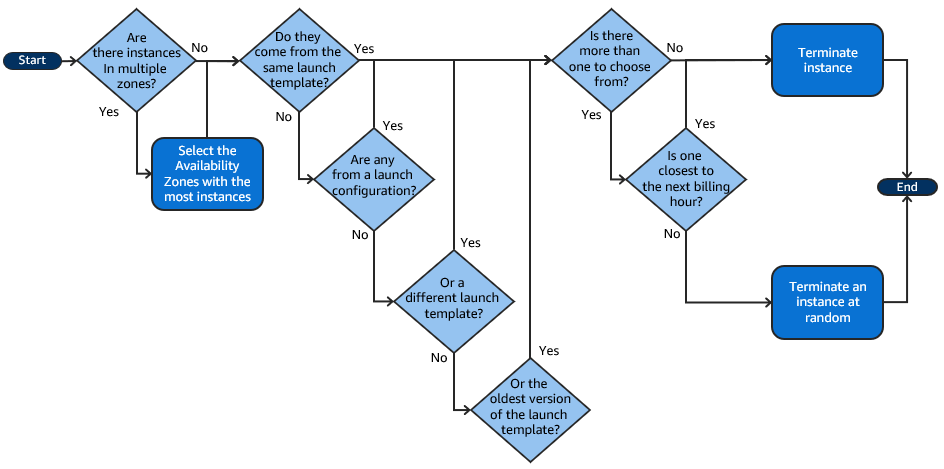

# EC2 instances

## `Spot instances`

- Set a price, pay as long the instances has the desired price
- **Can be removed at any time**.
- You have two minutes to save your work before the instance is terminated.

## `Reserved instances`

- Reserve for a period of time
- **Cost is covered upfront**.
- **Up to 75% discount** compared to on-demand instances

## `Saving plans`

- Can be used for EC2, Fargate, Lambda
- You pay and get a discount in exchange for a commitment of usage

## `Dedicated hosts`

- Dedicated physical servers for your usage only

## `Capacity reservations`

- Used to make sure the capacity you want is available
- You get charged no matter if you have an instance running or not

## `Placement groups`

- When you want to control the placement strategy instead of letting AWS manage that
  1. **Cluster** Low latency, high network throughput. 10 Gbps bandwidth with network enabled
  2. **Spread** The opposite of cluster. All instances are in different AZ. It adds latency to the network communications. It is limited to 7 instances per group
  3. **Partition** Up to 7 partitions per ZA. Each partition is on a physical rack. Can spread across AZ. Each partition can have hundreds of EC2 instances

## EC2 hibernate

- You can stop/terminate instances
- With hibernate RAM state is preserved. Boot is faster
- RAM state is saved in the EBS volume
  - EBS must be encrypted
  - EBS should have space to save RAM state
  - RAM must be less than 150 GB
  - Not all instance families support this feature. Available for
    - On-demand
    - Reserved
    - Spot instances
  - Instances cannot be hibernated more than 60 days

## [Instance termination default policy](https://docs.aws.amazon.com/autoscaling/ec2/userguide/as-instance-termination.html)

