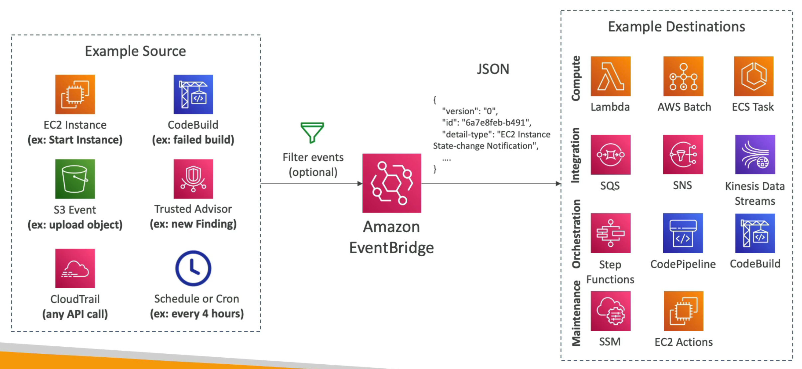

# Amazon EventBridge

Formerly known as `CloudWatch Events`, Amazon EventBridge is a serverless event bus service that makes it easy to connect applications through events and rules. It can be used to build event-driven architectures, decoupling applications, and integrating services.

