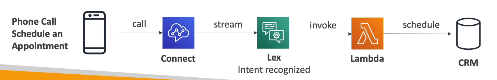

# Amazon Lex + Connect

`Lex` is the same technology that **powers Alexa**. It is a service for building conversational interfaces into any application using voice and text. `Amazon Connect` is a **cloud-based contact center service** that makes it easy to deliver customer service at scale.

- Can integrate with other CRM systems or AWS
- Can be used to build chatbots
- No upfront costs, 80% cheaper than traditional contact centers

