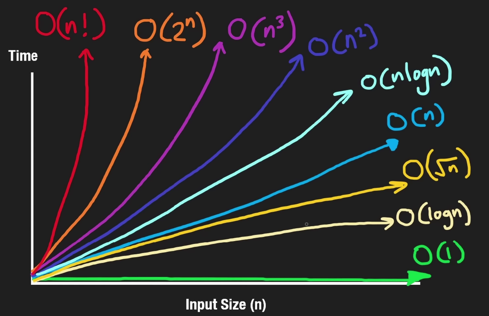

# [Big O notation](https://www.bigocheatsheet.com/)

## Good time complexity

- `O(1)` - Constant time
- `O(log n)` - Logarithmic time
- `O(sqrt(n))` - Square root time

## Middle time complexity

- `O(n)` - Linear time
- `O(n log n)` - Linearithmic time

## Bad time complexity

- `O(n^2)` - Quadratic time
- `O(n^3)` - Cubic time
- `O(2^n)` - Exponential time
- `O(n!)` - Factorial time
