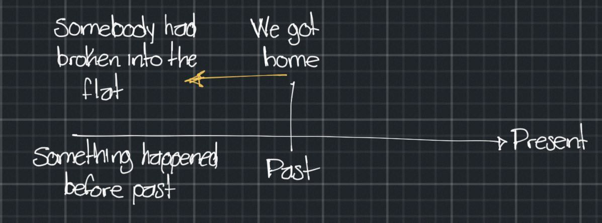

# Past perfect (**I had done**)

**I/we/they/you/he/she/it** + **had** (I'd, he'd, she'd, etc...) + **past participle**

The past perfect simple is used to talk about an action that happened before another action in the past.
Sometimes we talk about something that happened before this time, we use the past perfect

> When we got home last night, we found somebody **had broken** into the flat

## Extra materials

- [Pasado perfecto. Formas: afirmativa, negativa e interrogativa](https://avi.cuaieed.unam.mx/uapa/avi/ing_6/U_2/ing6_u2_t1/index.html)
