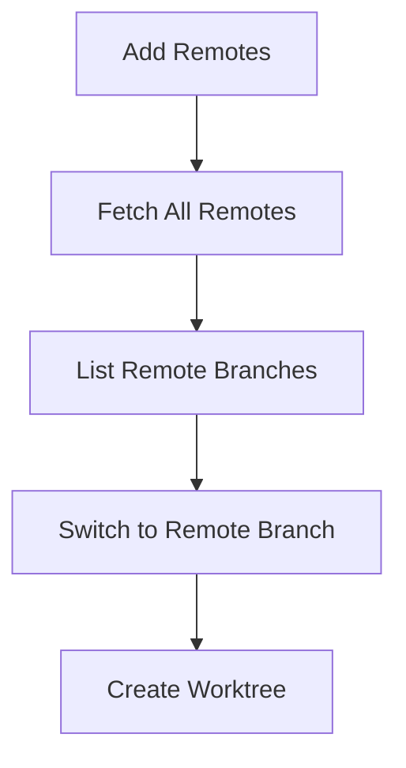

# Simple Git Workflow

This workflow helps you manage forks and collaborate with team members efficiently. It allows you to review pull requests and work on remote branches without cloning multiple repositories.

## Workflow Overview



## Terminology

- **upstream**: The original repository you forked from.
- **team-member**: A teammate's remote repository.
- **worktree**: A linked working directory for a branch, useful for parallel development.

## Example variable values

- `$branch-name`: feature-xyz
- `$remote`: upstream or team-member
- `$path-to-new-worktree`: ../worktree-feature-xyz

## Commands

```bash
# 1. Set your upstream and other remotes
# (Run these only once per repo)
git remote add upstream $url-of-original-repo   # Add original repo as upstream
git remote add team-member $url-of-team-member-repo   # Add teammate's repo

# 2. Fetch all remotes
git fetch --all   # Update all remotes

# 3. List branches from a specific remote
git ls-remote --heads upstream      # See branches in upstream
git ls-remote --heads team-member   # See branches in team-member

# 4. Switch to a specific remote branch
# -t: set up branch to track remote branch
# -c: create a new branch locally
# Example: git switch -t -c feature-xyz upstream/feature-xyz
git switch -t -c $branch-name $remote/$branch-name

# 5. Generate a worktree from a specific remote branch
# -b: create a new branch
# --track: set up branch to track remote branch
# $path-to-new-worktree: path to the new worktree directory
# Example: git worktree add -b feature-xyz --track ../worktree-feature-xyz upstream/feature-xyz
git worktree add -b $branch-name --track $path-to-new-worktree $remote/$branch-name
```

## Troubleshooting & FAQ

> **Remote already exists?**
> Run `git remote -v` to check existing remotes. Remove with `git remote remove <name>` if needed.

> **Branch already exists?**
> Use `git branch` to list local branches. Delete with `git branch -d <branch-name>`.

> **Worktree already exists?**
> Remove with `git worktree remove <path-to-worktree>`.

> **Tracking issues?**
> Use `git branch -vv` to see tracking info.

## Best Practices

- Use descriptive branch names (e.g., `feature/login-page`).
- Regularly fetch and pull to keep remotes up to date.
- Use worktrees for parallel development to avoid conflicts.
- Clean up unused branches and worktrees.
