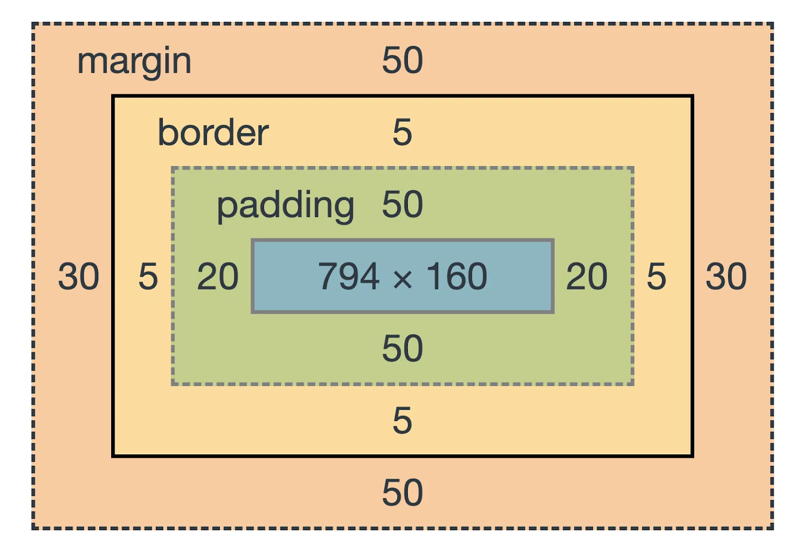

# CSS Box Model

The CSS box model is a fundamental concept that describes how elements on a web page are structured and how their dimensions are calculated. Every HTML element can be considered as a rectangular box, which consists of four main components

1. `content`
2. `padding`
3. `border`
4. `margin`

