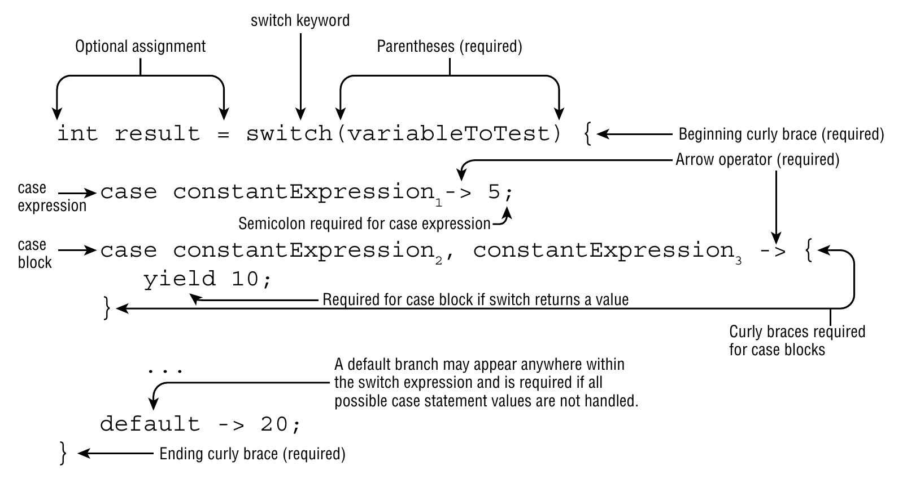

# Switch expressions

Switch expressions were introduced in Java 12 as a preview feature and became a standard feature in Java 14. They provide a more concise and flexible way to handle multiple conditions. Unlike [traditional switch](./switch.md) statements, switch expressions can return a value, making them more versatile.



## Key Features

- `Single value evaluation` switch expressions evaluate to a single value.
- `Arrow syntax (->)` when a case matches, the arrow operator `->` is used to specify the value to return.
- `Yield statement` use yield to specify the value of a switch expression.

## Advantages

- `Conciseness` less boilerplate code compared to traditional switch statements.
- `Readability` easier to read and maintain.
- `Safety` eliminates the risk of fall-through errors.

## Example

```java
public enum Day {
    SUNDAY, MONDAY, TUESDAY, WEDNESDAY, THURSDAY, FRIDAY, SATURDAY;
}

Day day = Day.WEDNESDAY;

int numLetters = switch (day) {
    case MONDAY, FRIDAY, SUNDAY -> 6;
    case TUESDAY -> 7;
    case THURSDAY, SATURDAY -> 8;
    case WEDNESDAY -> 9;
    default -> throw new IllegalStateException("Invalid day: " + day);
};

log.info(numLetters); // Outputs: 9
```

- All the permutations of the *control variable* must be covered.
- If not, a `default` case must be provided.

## `yield` statement

Can be used to return a value from a switch expression when we need to add a complex logic or multiple statements.

```java
int result = switch (variable) {
    case VALUE1 -> {
        // complex logic
        yield EXPRESSION1;
    }
    case VALUE2 -> EXPRESSION2;
    default -> DEFAULT_EXPRESSION;
};
```
