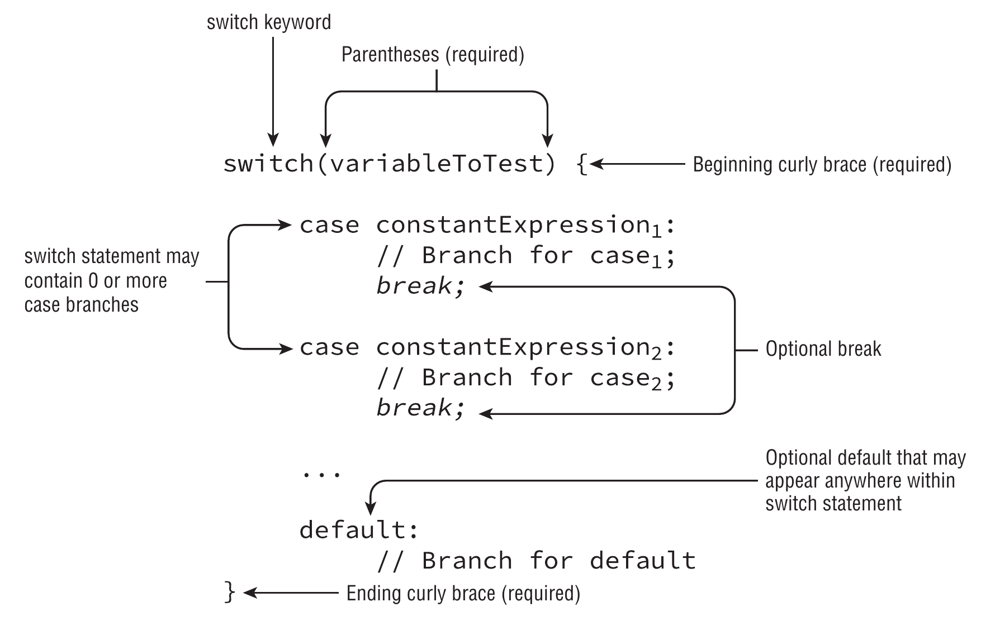

# `switch`



## Basic syntax

``` java
switch (option) {
    case "A":
    case "B":
        // Statements A and B
        break;
    case "C":
        // Statements for case C
        break;
    default:
        // Default case
}
```

## Allowed types

This also includes their wrappers for the primitive types

- `byte`
- `char`
- `short`
- `int`
- `enum`
- `String`

## `case` constants

- Must be **compile time constants**
- Must be assignable to the `switch` variable
- Must be within the range of the `switch` variable. E.g. a `case 200` cannot be assigned to a `byte` variable
- `break` is optional
  - If omitted the next `case` statements will be executed
- Cannot have repeated case values
- `default` case is optional
  - At most one per `switch`
  - Where it appears does not matter
