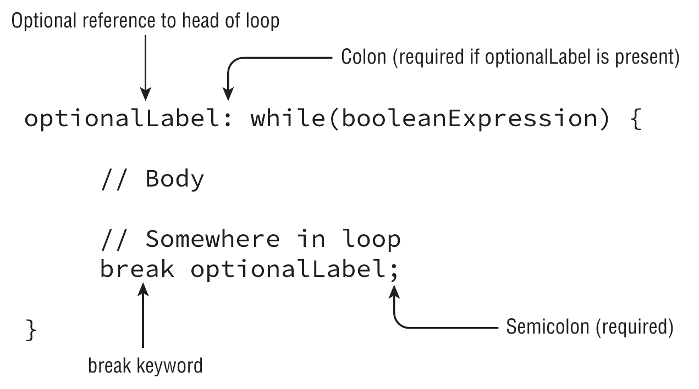

# `break`



It is highly similar to the [continue](continue.md) statement

In a normal case, the `break` statement transfers the control out to the enclosing statement or loop

This is true for

- [`while` loop](while.md)
- [`do`...`while` loop](do_while.md)
- [`for` loop](for.md)
- [enhanced `for` loop](for_each.md)
- [switch](../conditionals/switch.md)

When used with a label, the control is transfer to the structure with that specific label. This can be used to change the loop flow

``` java
EXIT_LOOP:
for ( ; ; ) { // Without the label, this would be an infinite loop
    for (int i = 1; ; i++) {
        if (i == Byte.MAX_VALUE) {
            break EXIT_LOOP;
        }
    }
}

log.info("Finished counting to {}", Byte.MAX_VALUE);
```
