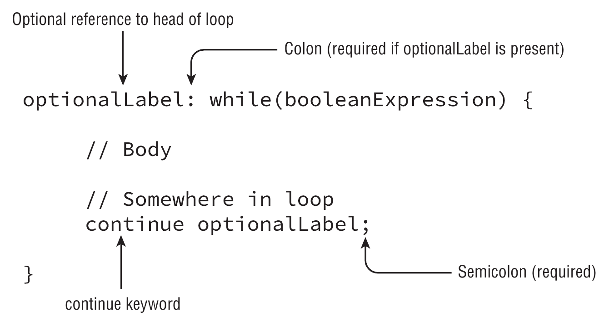

# `continue`



It is highly similar to the [break](break.md) statement

In a normal case, the `continue` statement transfers the control out to the enclosing statement or loop

This is true for

- [`while` loop](while.md)
- [`do`...`while` loop](do_while.md)
- [`for` loop](for.md)
- [enhanced `for` loop](for_each.md)

When used with a label, the control is transfer to the structure with that specific label. This can be used to change the loop flow

``` java
OUTER:
for (int i = 1; i < Byte.MAX_VALUE; i++) {
    while (true) { // Without the label, this would be an infinite loop
        if (i % 2 == 0) {
            log.info("{}", i);
        }

        continue OUTER;
    }
}
```
