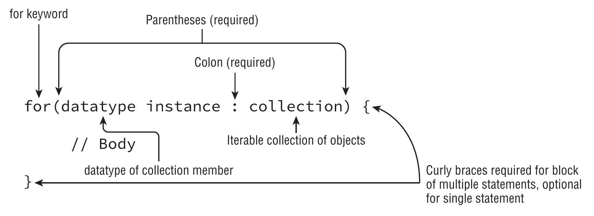

# Enhanced `for` loop

Is a specialized structure designed to iterate over arrays and various Collection framework classes.

The accepted types are

- A built-in Java array
- An object whose type implements [`java.lang.Iterable`](https://docs.oracle.com/en/java/javase/11/docs/api/java.base/java/lang/Iterable.html)
