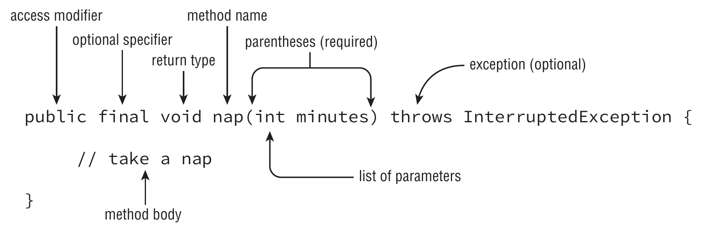

# Method declaration

Method names follow the same rules for naming as [variables](../variables/naming.md)

This is named `method declaration` and defines all the information required to call the method. The method parameters are known as the `method signature`

## Parts of method declaration

| Element                 | Value in nap() example      | Required?                         |
|-------------------------|-----------------------------|-----------------------------------|
| Access modifier         | public                      | No                                |
| Optional specifier      | final                       | No                                |
| Return type             | void                        | Yes                               |
| Method name             | nap                         | Yes                               |
| Parameter list          | (int minutes)               | Yes, but can be empty parentheses |
| Optional exception list | throws InterruptedException | No                                |
| Method body             | { // take a nap }       | Yes, but can be empty braces      |
