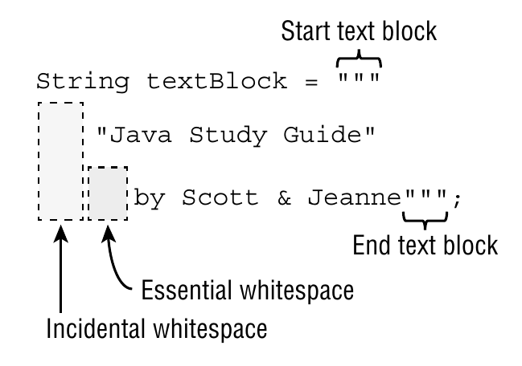

# Text blocks

Is a **new feature in Java 13** that allow you to write multi-line strings without having to escape newlines or double quotes. They are surrounded by three double quotes `"""` and can contain newlines, double quotes, and tabs.

> The opening delimiter `"""` **MUST** be followed by a newline

```java
String query = """
    SELECT
        id, name, lastname, age
    FROM EMPLOYEE_TB
    WHERE CITY = 'INDIANAPOLIS'
    ORDER BY id DESC;
    """;
```

## *Incidental* and *essential* whitespace

### Incidental whitespace

Incidental whitespace is the whitespace that is present in the text block but is not part of the string content. It is used to format the text block in a readable way.

### Essential whitespace

Essential whitespace is the whitespace that is part of the string content. It is used to format the string content in a specific way.


