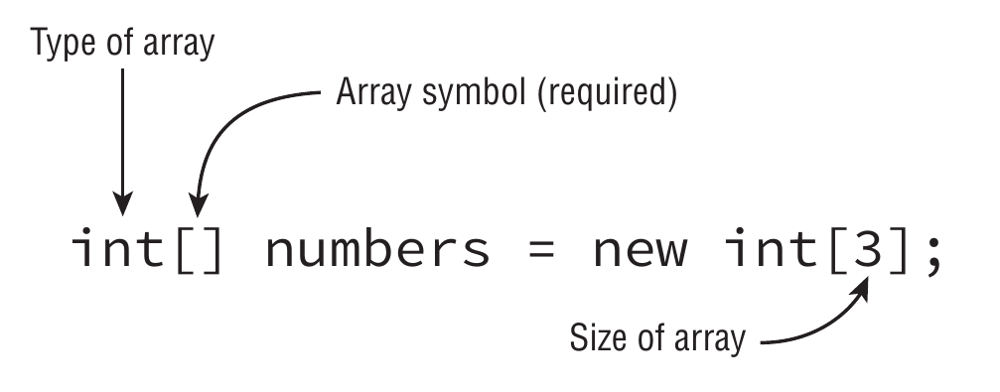

# Arrays



> Array indexes start at `0`

## Alternative syntaxes

``` java
int[] arrayA;
int [] arrayB;
int []arrayC;
int arrayD[];
int arrayE [];

// Initialization in the same sentence. a.k.a anonymous array
char[] hexLetters = {'A', 'B', 'C', 'D', 'E', 'F'}; // Array length is implicit

// Quirky array declaration
int [] one, two; // Two int[] arrays declared
int array[], number // One int[] array and an int variable
```

## Printing and sorting an array

``` java
int[] array = {5, 2, 1, 4, 3};
log.info("{}", Arrays.toString(array));

Arrays.sort(array); // Modifies the original array. It also can accept a Comparator
log.info("{}", Arrays.toString(array));
```

## Sorting considerations

- Strings (no matter if they contain numbers) are sorted in alphabetical order
  - `1` sorts before `9`
  - Numbers sort before letters
  - Uppercase sorts before lowercase

``` java
String[] strings = { "10", "9", "100" };
Arrays.sort(strings);

log.info("{}", Arrays.toString(strings));
```

> **Output**
> [10, 100, 9]

## Searching

> Binary search requires a sorted array. **If the array is not sorted the output is unpredictable**

``` java
int[] numbers = {2, 4, 6, 8};

log.info("{}", Arrays.binarySearch(numbers, 2));
log.info("{}", Arrays.binarySearch(numbers, 4));
log.info("{}", Arrays.binarySearch(numbers, 1));
log.info("{}", Arrays.binarySearch(numbers, 3));
log.info("{}", Arrays.binarySearch(numbers, 9));
```

> **Output**
> 0
> 1
> -1
> -2
> -5

## [Arrays.compare()](https://docs.oracle.com/en/java/javase/11/docs/api/java.base/java/util/Arrays.html#compare(boolean%5B%5D,boolean%5B%5D))

### General rules

1. A negative number meas the first array is smaller than the second
2. A zero means the arrays are equal
3. A positive number means the first array is larger than the second

### Specific rules

1. If **both arrays are the same length** and have the **same values** in each spot in **the same order**, **return zero**
2. If **all the elements are the same but** the **second array has extra elements at the end**, **return a negative number**
3. If **all the elements are the same but** the **first array has extra elements at the end**, **return a positive number**
4. If the **first element** that **differs is smaller in the first array**, **return** a **negative number**
5. If the **first element** that **differs is larger in the first array**, **return** a **positive number**

### What does smaller means?

1. `null` is **smaller than any other value**
2. For **numbers**, **normal numeric order applies**
3. For **strings**, one is **smaller if it is a prefix of another**
4. For **strings/characters**, **numbers are smaller that letters**
5. For **strings/characters**, **uppercase is smaller than lowercase**
