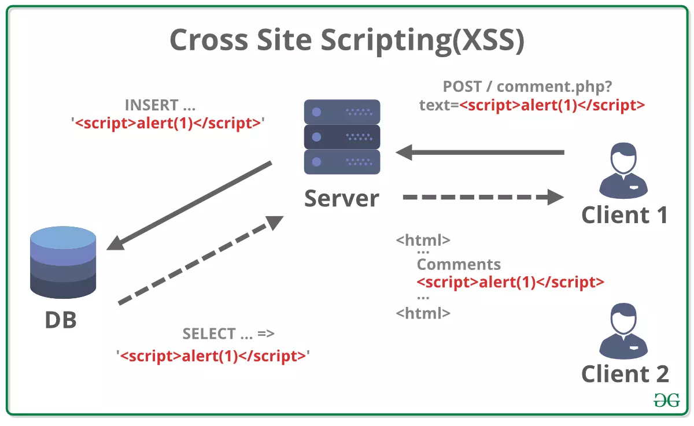

# Reflected Cross-Site Scripting (XSS)

Reflected cross-site scripting (XSS) is a type of attack where an attacker injects malicious scripts into a vulnerable web application. The injected script is reflected off the web server and executed

## See also

- [Stored Cross-Site Scripting (XSS)](stored-xss.md)
- [Types of XSS](https://owasp.org/www-community/Types_of_Cross-Site_Scripting)
- [Cross Site Scripting (XSS)](https://owasp.org/www-community/attacks/xss/)
- [Cross Site Scripting Prevention Cheat Sheet](https://cheatsheetseries.owasp.org/cheatsheets/Cross_Site_Scripting_Prevention_Cheat_Sheet.html)
