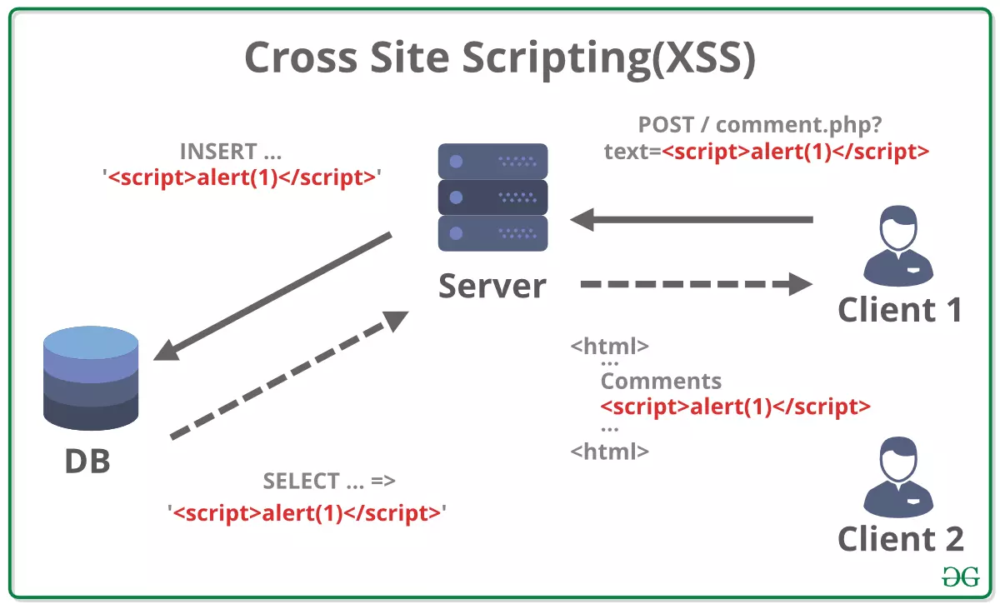

# Stored cross-site scripting (XSS)

It is also known as **persistent XSS**, **Type-I XSS**, or **persistent client-side script injection**. It occurs when an attacker injects malicious scripts into a vulnerable application. The injected script is stored on the server and executed when other users access the affected page

## See also

- [Reflected Cross-Site Scripting (XSS)](reflected-xss.md)
- [Types of XSS](https://owasp.org/www-community/Types_of_Cross-Site_Scripting)
- [Cross Site Scripting (XSS)](https://owasp.org/www-community/attacks/xss/)
- [Cross Site Scripting Prevention Cheat Sheet](https://cheatsheetseries.owasp.org/cheatsheets/Cross_Site_Scripting_Prevention_Cheat_Sheet.html)
