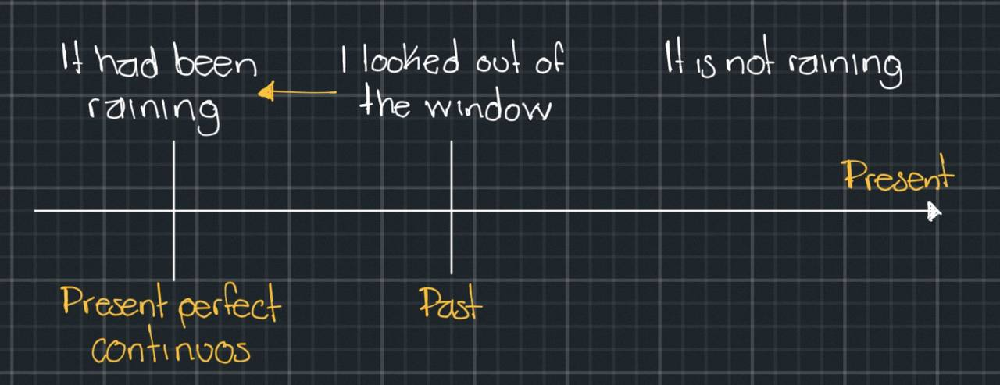

# Past perfect continuous (**I had been doing**)

**I/we/you/they/he/she/it** + **had been** + **verb-ing**

> Yesterday morning I got up and looked out of the window. The sun was shining but the ground was very wet. **It had been raining**

The past perfect continuous is *used to describe actions that were in progress at an earlier time in the past*. In other words, **an action that was in progress before another event in the past**

> It was not raining when I looked out of the windows; the sun was shining, But **it had been raining** before

1. At least the bus came. **I had been waiting** for 20 minutes
2. James was out of breath. **He had been running**
3. The sun was shining. But **it had been raining**, so the ground was wet

## Extra materials

- [Pasado perfecto continuo. Formas: afirmativa, negativa e interrogativa](https://avi.cuaieed.unam.mx/uapa/avi/ing_7/U_2/ing7_u2_t3/index.html)
