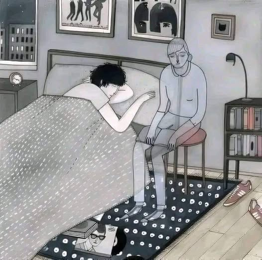

# [No estés triste](https://www.facebook.com/abril.juarez.733450/posts/no-est%C3%A9s-triste-nos-volveremos-a-encontrarabre-tus-ojitos-tal-vez-no-me-puedas-v/1935342993600450/)

No estés triste… nos volveremos a encontrar.\
Abre tus ojitos, tal vez no me puedas ver pero en tus sueños me podrás encontrar.\
No te aferres a la idea de que debía continuar a tu lado, todo tiene un principio y un fin pero te prometo que continuaré en tu memoria.\
Cuando no logres encontrarme en tus sueños no despiertes con desánimo o enojo, me fui a refugiar a tu corazón.\
Habrá días que pasarán volando y está bien, no necesariamente es para que me olvides, es para que sanes tu herida más pronto.\
La vida no ha sido injusta ni cruel, la vida con todas sus cosas buenas y malas, es bella, muy bella.\
No importa en donde se encuentre cada uno ahora, nuestros corazones continuarán conectados.\
No llores por mí, por favor, estoy muy bien, en un estado de profunda tranquilidad, con una paz que no podría explicarte pero que me hace sentir feliz, tus lágrimas no me traerán de vuelta, no te tortures más, no pienses en que pudo ser diferente porque eso no marca una diferencia, si yo lo he aceptado, acéptalo tú también y sigue adelante.\
No pienses jamás en darte por vencido, se fuerte, no te rindas, tu puedes, siempre has podido y siempre podrás.\
No podemos tocarnos pero aún podemos sentirnos. La magia no se ha terminado si continúas recordándome y llevándome en tu corazón.\
Vive por ti, por mí, por quien tú quieras pero vive, disfruta esta hermosa vida que Dios nos dio hoy estamos y mañana tal vez no.\
Busca tu felicidad en esos pequeños obsequios tan preciosos que nos da la vida; la luz de la luna, el viento, la lluvia, el vuelo de un ave, lo bello de los paisajes. Vive y continuaré viviendo a través de ti.\
Y cuando no logres sentirme a tu lado, cuando no aparezca más en tus sueños, en esos pequeños obsequios que casi nunca valoramos me habrás de encontrar, te prometo que te daré una señal.\
Respira, fluye, avanza, ¡tú puedes!, siempre has podido y siempre podrás.🥺

